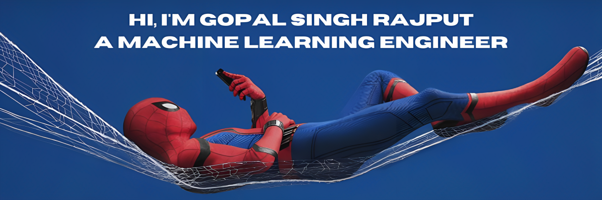

    

I'm currently studying 3rd year CSE with specialization in AI/ML at VIT Chennai. I am a Machine Learning Engineer. I am a Detail oriented team player with strong organizational skills. Ability to handle multiple projects simultaneously with a high degree of accuracy. An organized and dependable candidate successful at managing multiple priorities with a positive attitude. I am willing to take on added responsibilities to meet team goals. To seek and maintain a full-time position that offers professional challenges utilizing interpersonal skills, excellent time management, and problem- solving skills.

<h2 align="center">Technology Stack </h2> 

 

<h2 align="center">Reach me out on </h2>

 

  

